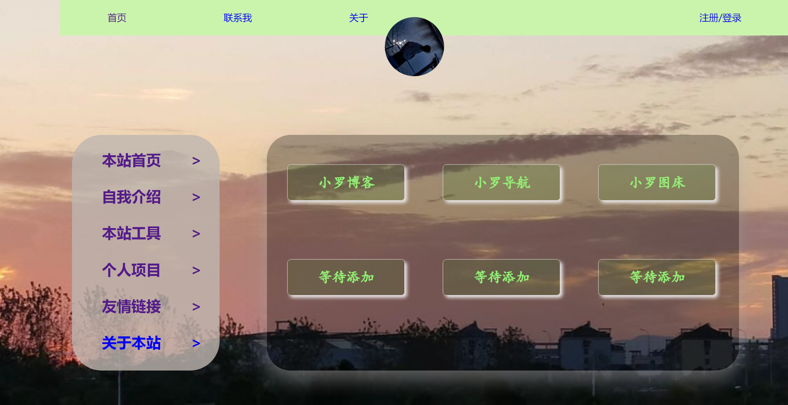
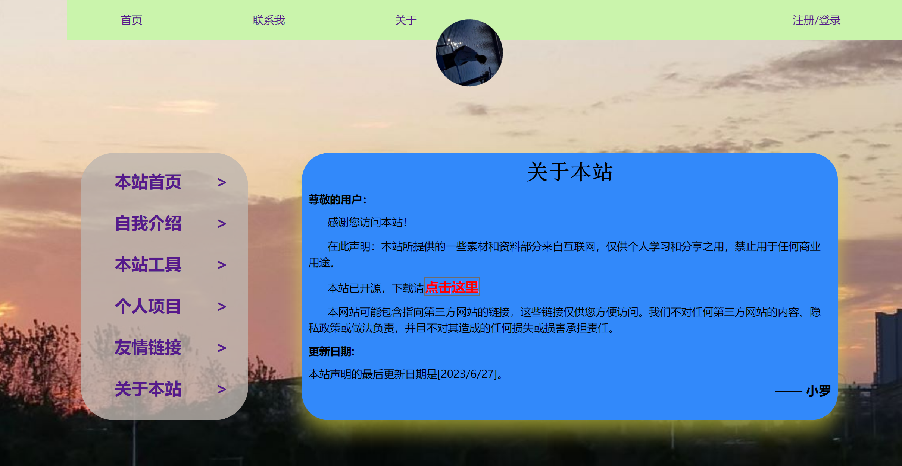

# 明辰个人主页

## 1. 效果截图

#### 主页1


#### 主页2


#### 主页3



#### 主页4




## 2. 介绍
  去年写的一直忘记发了哈哈哈，感觉写的不是很满意哈哈哈，有些地方感觉有点问题

大家凑合再看看吧哈哈哈


## 3. 代码

### Js

- `daily-saying.js`实现了“每日一言”功能，通过jQuery异步获取并展示API提供的随机引述及作者信息。

### CSS样式

- 全局样式表`style.css`设定基础样式框架，包括全局样式重置、主体尺寸与背景、文本样式等。
- 特定页面/组件样式：
  - `about-myweb.css`：为“关于我的网站”页面定制样式。
  - `box.css`：定义各类盒子组件样式，如导航菜单、内容区域布局与响应式设计。
  - `daily-saying.css`：“每日一言”样式。
  - `footer.css`：页脚区域样式与响应式设计。
  - `friend-link.css`：“好友链接”列表样式。
  - `header.css`：头部区域（含导航、搜索、徽标等）样式与响应式设计。

## 4. 文件结构

```bash
mingchen-one-homepage/
├── css/
│   ├── about-myweb.css
│   ├── box.css
│   ├── daily-saying.css
│   ├── footer.css
│   ├── friend-link.css
│   ├── header.css
│   └── style.css
├── js/
│   └── daily-saying.js
└── index.html  
```

## 5.最好，大家有什么建议可以提提哈，这是之前老早写的，后期有时间推出点更强大的

